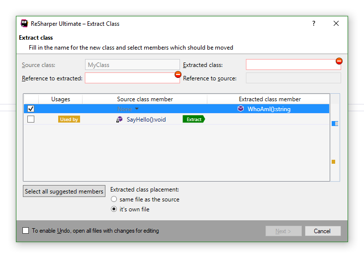

## Рефакторинг "Выделение класса" (Extract class)

Для выделения интерфейса щелкните правой клавишей мыши по имени любого из требуемых методов и выберите `Refactor->Extract->Extract Class`

Получите такое окно:

В нем требуется указать имя нового класса и выбрать методы для извлечения. 

**Небольшой лайфхак:** если начать писать имя извлекаемого класса (Extracted class), то поле "Reference to extracted" заполнится автоматически в соответствии с настройками Resharper для имени поля класса.

После заполнения получаем:

Нажимаем "Next", смотрим результат:

