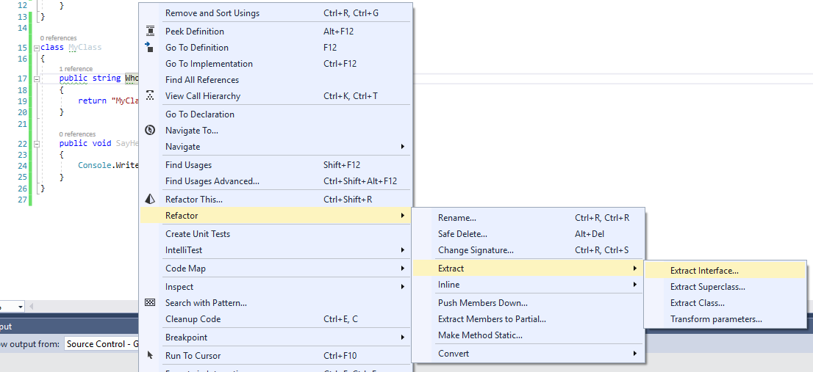

## Рефакторинг "Выделение интерфейса" (Extract interface)

Для выделения интерфейса щелкните правой клавишей мыши по имени любого из требуемых методов и выберите `Refactor->Extract->Extract Interface`

Получите такое окно:

В нем выбираем имя интерфейса и методы, которые требуется вынести в интерфейс. По умолчанию выбирается корректное имя (в соответствии с codestyle-ом языка C#), но создает интерфейс в том же файле. 

Жмем "Next" и получаем следующий код:

P.S. Также стоит заметить, если хотя бы один из выбранных методов не был объявлен с модикатором `public`, Resharper предложит изменить модификаторы доступа на `public`. Аналогичное уведомление будет получено, если попытаться создать интерфейс с уже существующим именем.

