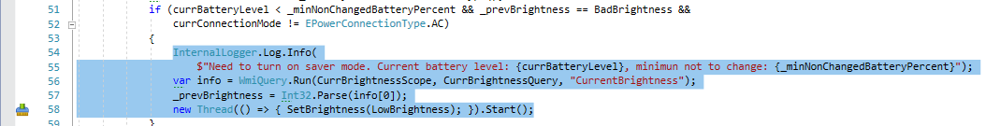
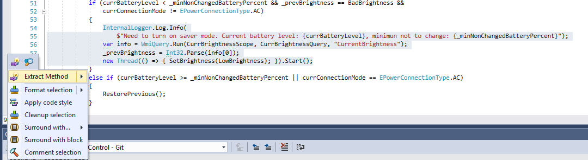
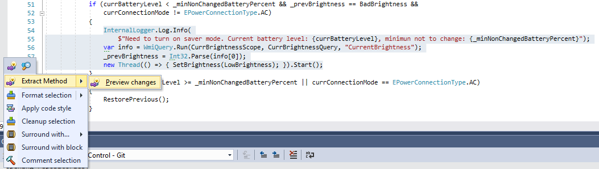
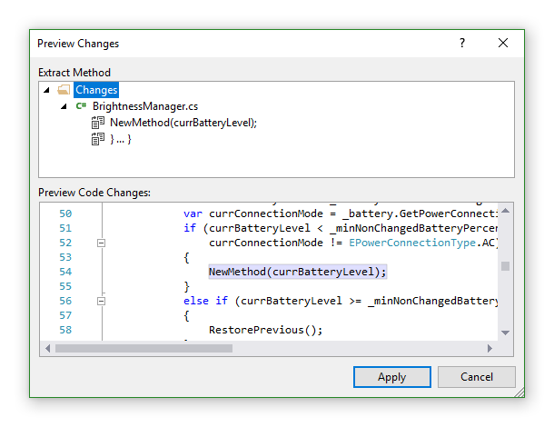
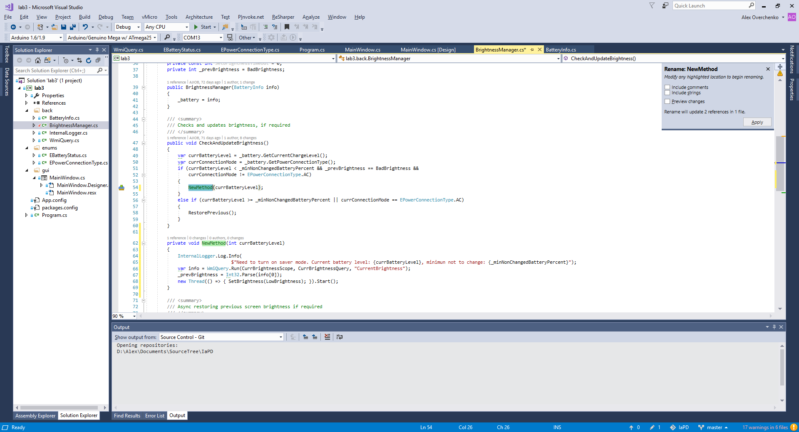
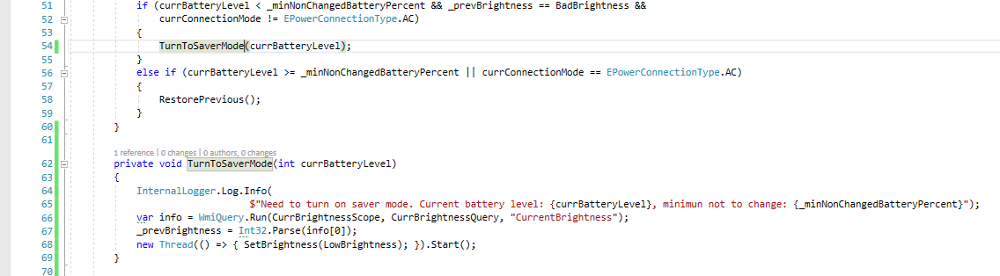

## Рефакторинг "Выделение метода" (Extract method)

Для выделения метода выделите требуется выделить необходимый участок кода. Появится иконка как на рисунке ниже:

Нажимаем на эту иконку (у меня также можно было импользовать комбинацию клавиш `Alt+Enter`) и выбираем секцию `Extract Method` для выделения метода (рисунок ниже).

Или же можно предварительно посмотреть изменения: как Resharper извлечет этот метод. Для этого выбираем секцию `Extract Method -> Preview changes`

Пример окна предпросмотра изменений

При нажатии "Apply" (или выбора меню `Extract Method`) произойдет извлечение метода, и вам будет предложено ввести имя нового метода (новое имя метода выделено на салатовом фоне)

Просто вводим имя нового метода (я назвал его "TurnOnSaverMode")

И нажимаем "Enter". Изменения автоматически применяются.

P.S. не забудьте сохранить документ по завершению рефакторинга