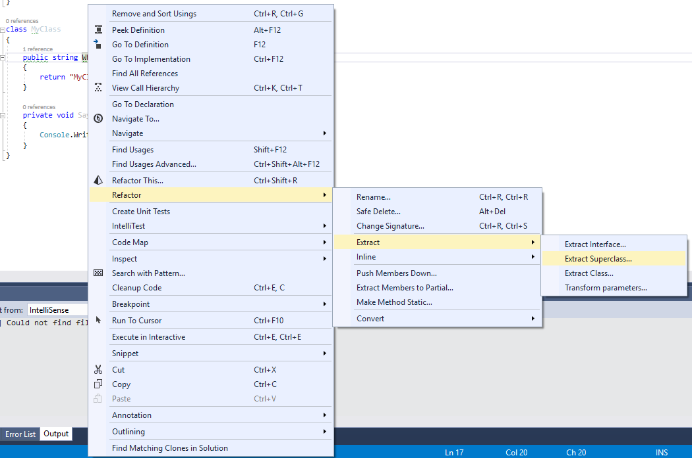
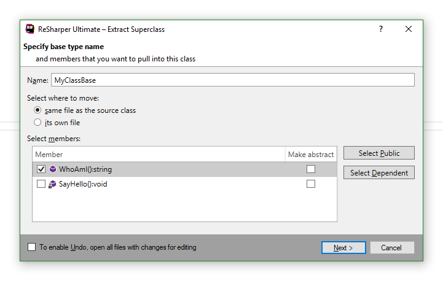
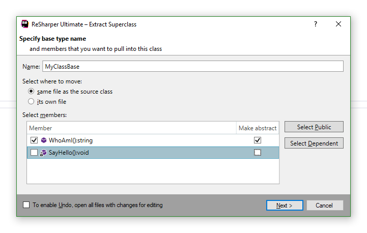
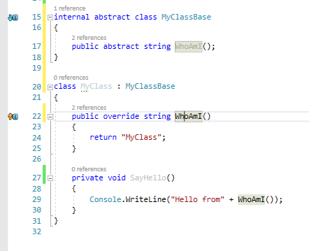

## Рефакторинг "Выделение родительского класса" (Extract superclass)

Для выделения интерфейса щелкните правой клавишей мыши по имени любого из требуемых методов и выберите `Refactor->Extract->Extract Superclass`

Появится следующее окно:

В нем по умолчанию написано предлагаемое имя базового класса. Добавляем требуемые методы и конфигурацию в базовый класс. Получаем:

Нажимаем "Next", и все успешно отрабатывает:

