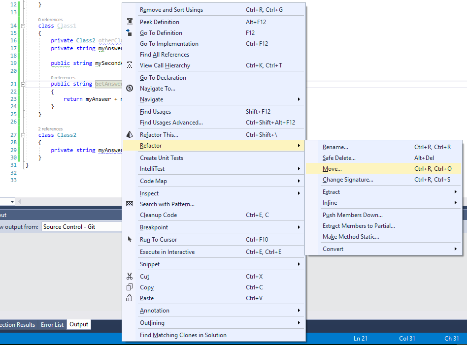
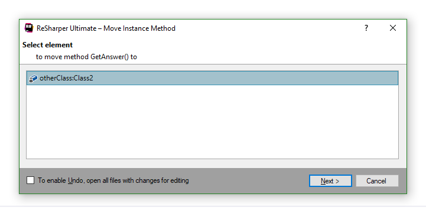
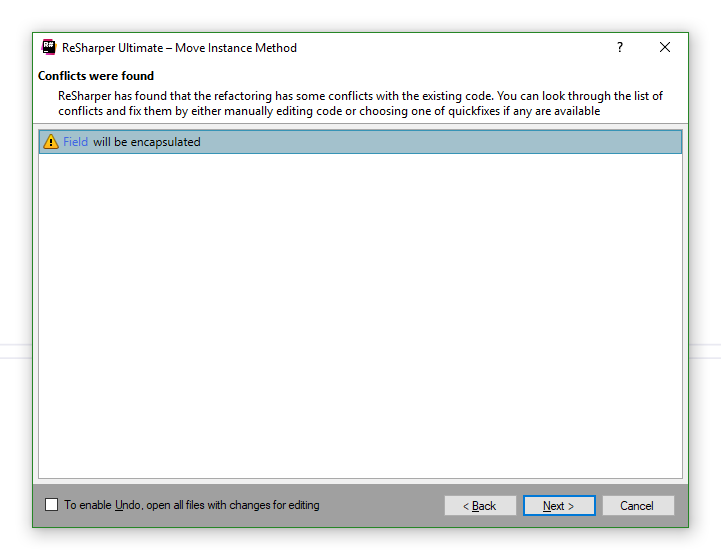
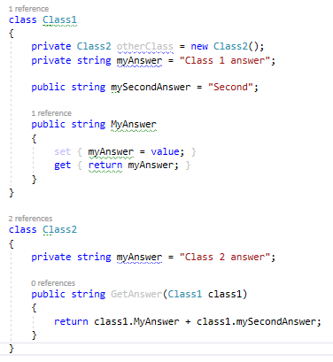
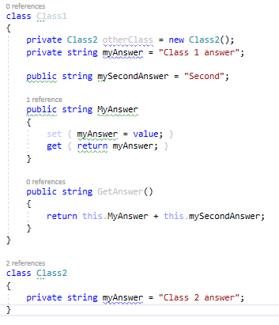

## Рефакторинг "Перемещение поля" (Move Field)

## Рефакторинг "Перемещение метода" (Move Method)

Для перемещения метода (поля) щелкните правой клавишей мыши по имени любого из требуемых методов и выберите `Refactor->Move...`

Далее Resharper попросит выбрать куда произвести перемещение. Производить перемещение можно только в классы, которые связаны ассоциацией с классом-источником.

Нажимаем "Next", появляется окно разрешения конфликтов (если таковых нет - оно пропускается)

Оно предлагает разрешить конфликты в автоматическом режиме, либо нажать кнопку отмена и разрешить вручную. Затем нужно будет просто повторить предыдущие шаги.

Если выбрать разрешение в автоматическом режиме (нам нужно будет просто инкапсулировать поле в свойство), получим следующее:

Если же снова проделать данную операцию для перемещенного метода, то все сразу пройдет без конфликтов. Результат выполнения:

P.S. Перемещать можно только статические поля класса.

