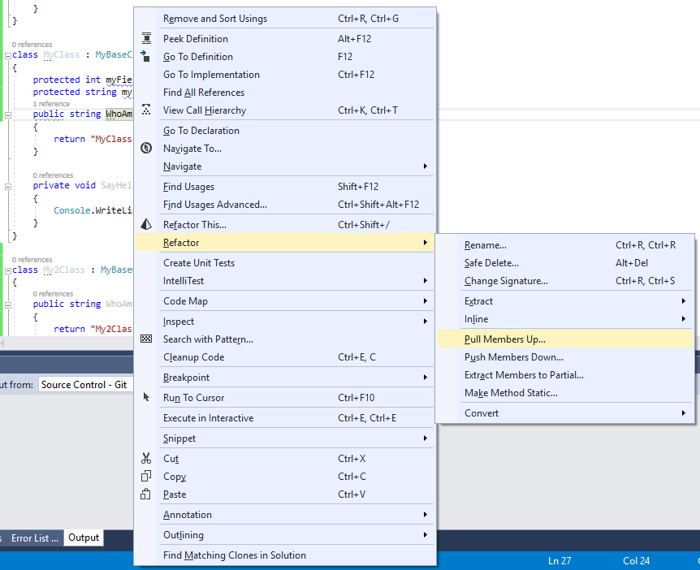

## Рефакторинг "Подъем метода" (Pull Up Method)

## Рефакторинг "Подъем поля" (Pull Up Field)

Для подъема метода (или поля) щелкните правой клавишей мыши по имени любого из требуемых методов и выберите `Refactor->Pull Members Up...`

Далее Resharper попросит выбрать поднимаемые методы и поля. По умолчанию будет выбрано то поле (метод), для которого была выбрана операция.

Нажимаем "Next", проверяем результат

