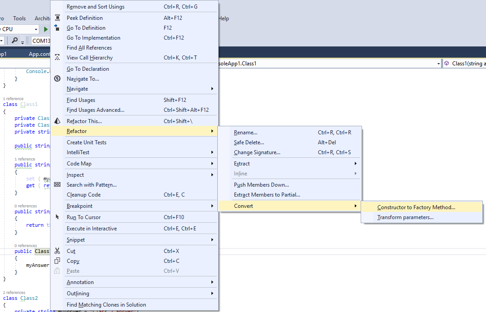

## Рефакторинг "Замена конструктора фабричным методом" (Replace constructor with factory method)

Исходный код:

Для замены конструктора фабричным методом щелкните правой клавишей мыши по имени требуемого конструктора в классе и выберите `Refactor->Convert->Constructor to Factory Method...`

Получите такое окно:

В нем набираем имя фабричного метода, который будет скрывать требуемый констуктор. Также можно выбрать класс, в котором этот метод нужно разместить. По умолчанию выбирается корректное имя (в соответствии с codestyle-ом языка C#), но имя метода совпадает с именем конструктора. 

Для примера дадим методу имя `Class1Factory`:

Жмем "Next" и получаем следующий код:

В данном коде требуемый конструктор переведен в категорию `private` и появился статический метод, который занимается вызовом этого конструктора и возвращением созданного объекта

P.S. Если не изменить целевой класс или имя метода в окне генерации метода, появится ошибка, которая говорит, что это имя доступно только для конструкторов и деструкторов, но при этом все равно создаст метод с требуемым именем, если нажать "Next".

