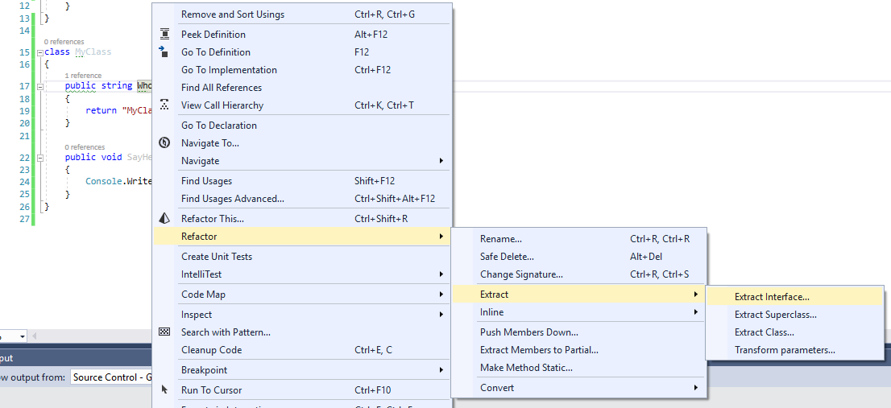

# Resharper

## Рефакторинг Выделение интерфейса (Extract interface)

Для выделения интерфейса щелкните правой клавишей мыши по имени любого из требуемых методов и выберите `Refactor->Extract->Extract Interface`

